<div align="center">

<!-- ============ BANNER PERSONALIZADO ============ -->


<!-- ============ TYPING EFFECT ============ -->
<a href="https://github.com/angeldevmobile">
  
</a>

<br/><br/>

<!-- ============ BADGES SOCIALES ============ -->
[](https://linkedin.com/in/gabriel-zapata-239501287/)
[](https://portfolio-angel-dev.onrender.com/)
[](mailto:zapata.axuariogabriel@gmail.com)


</div>

<br/>

<!-- ============ ABOUT ME (con soporte dark/light) ============ -->
##  About me

```typescript
const angel = {
  role: "Full Stack & Backend Developer",
  location: "Perú 🇵🇪",
  languages: ["TypeScript", "Python", "Dart"],
  currentFocus: "Orion — AI Platform & custom programming language",
  background: "Banking & Fintech: secure payments, compliance, high-perf APIs",
  philosophy: "Build things that matter, ship things that work",
};
```

<br/>

<!-- ============ PROYECTOS ============ -->
## 🚀 What I'm building

<table>
<tr>
<td width="50%" valign="top">

### 🤖 Orion AI Platform
Plataforma con múltiples LLMs y workflows de automatización.

`React` `TypeScript` `Vite` `Node.js` `Express` `PostgreSQL` `Prisma` `OpenAI` `Claude`


</td>
<td width="50%" valign="top">

### ⚡ Orion Language
Lenguaje interpretado moderno con sintaxis limpia, keywords en español, stdlib integrada (`fs`, `json`, `code`) y VM de bytecode propia.

`Python` `ANTLR4` `Custom AST`


</td>
</tr>
<tr>
<td colspan="2">

```orion
use json
use fs

data = json.parse(fs.read("users.json"))
resumen = json.extract(data, ["nombre", "edad"])
show("Resumen:", resumen)
```

</td>
</tr>
<tr>
<td colspan="2">

### 🎵 Music Streaming App
App móvil multiplataforma con reproducción en tiempo real y features sociales.

`React Native` `TypeScript` `Firebase` `PostgreSQL` — 

</td>
</tr>
</table>

<br/>

<!-- ============ TECH STACK con iconos ============ -->
## 🛠️ Tech Stack

<div align="center">

**Languages**


**Frontend & Mobile**


**Backend & APIs**


**Databases & Cloud**


**AI & Integrations**

`OpenAI GPT` · `Anthropic Claude` · `LangChain` · `RAG Systems`

</div>

<br/>

<!-- ============ GITHUB STATS (dark/light adaptativo) ============ -->
## 📊 GitHub Stats

<div align="center">

<picture>
  <source media="(prefers-color-scheme: dark)" srcset="https://github-readme-stats.vercel.app/api?username=angeldevmobile&show_icons=true&theme=react&hide_border=true&bg_color=0d1117&title_color=F85D7F&icon_color=F8D866&text_color=FFFFFF&count_private=true">
  <source media="(prefers-color-scheme: light)" srcset="https://github-readme-stats.vercel.app/api?username=angeldevmobile&show_icons=true&hide_border=true&bg_color=ffffff&title_color=F85D7F&icon_color=F8D866&count_private=true">
  
</picture>
<picture>
  <source media="(prefers-color-scheme: dark)" srcset="https://github-readme-streak-stats.herokuapp.com/?user=angeldevmobile&theme=react&hide_border=true&background=0d1117&ring=F85D7F&fire=F85D7F&currStreakLabel=F85D7F">
  <source media="(prefers-color-scheme: light)" srcset="https://github-readme-streak-stats.herokuapp.com/?user=angeldevmobile&hide_border=true&ring=F85D7F&fire=F85D7F&currStreakLabel=F85D7F">
  
</picture>

<picture>
  <source media="(prefers-color-scheme: dark)" srcset="https://github-readme-stats.vercel.app/api/top-langs/?username=angeldevmobile&layout=compact&theme=react&hide_border=true&bg_color=0d1117&title_color=F85D7F&text_color=FFFFFF&langs_count=6&hide=html,css">
  <source media="(prefers-color-scheme: light)" srcset="https://github-readme-stats.vercel.app/api/top-langs/?username=angeldevmobile&layout=compact&hide_border=true&title_color=F85D7F&langs_count=6&hide=html,css">
  
</picture>

<!-- Activity graph animado -->


</div>

<!-- ============ SNAKE ANIMATION ============ -->
<div align="center">

<picture>
  <source media="(prefers-color-scheme: dark)" srcset="https://raw.githubusercontent.com/angeldevmobile/angeldevmobile/output/github-contribution-grid-snake-dark.svg">
  <source media="(prefers-color-scheme: light)" srcset="https://raw.githubusercontent.com/angeldevmobile/angeldevmobile/output/github-contribution-grid-snake.svg">
  
</picture>

</div>

<br/>

<!-- ============ CERTIFICACIONES Y APRENDIZAJE ============ -->
## 📜 Certifications & Learning

<table>
<tr>
<td width="50%" valign="top">

**Certifications**

- ☁️ Oracle Cloud Infrastructure 2023 Certified Foundations Associate — *Oracle*
- 🤖 Oracle Cloud Infrastructure 2023 AI Certified Foundations Associate — *Oracle*
- 🐍 Python for Data Science and AI — *Coursera*
- 🏅 IBM Mainframe Developer — *IBM · Coursera*
- 🏅 Google Data Analytics — *Google · Coursera*

</td>
<td width="50%" valign="top">

**Currently learning**

- ⚙️ Compiler design — LLVM, ANTLR4, AST optimization
- 🦀 Rust — systems programming
- 🧠 Advanced ML — RAG, LLM fine-tuning
- 🌐 Distributed systems patterns

</td>
</tr>
</table>

<br/>

<!-- ============ CONNECT ============ -->
## 🤝 Let's connect

<div align="center">

Abierto a colaborar en proyectos ambiciosos, discutir decisiones de arquitectura o simplemente hablar de tech.

[](https://linkedin.com/in/gabriel-zapata-239501287/)
[](mailto:zapata.axuariogabriel@gmail.com)
[](https://portfolio-angel-dev.onrender.com/)

<br/>

<sub><i>"Build things that matter, ship things that work."</i></sub>


</div>
