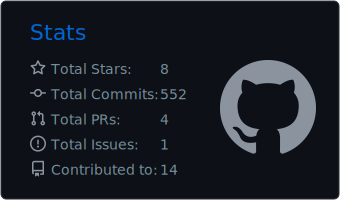
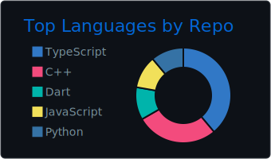
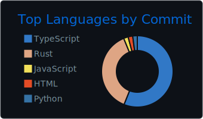

<div align="center">

<!-- ============ BANNER PERSONALIZADO ============ -->


<!-- ============ TYPING EFFECT ============ -->
<a href="https://github.com/angeldevmobile">
  
</a>

<br/><br/>

<!-- ============ BADGES SOCIALES ============ -->
[](https://linkedin.com/in/gabriel-zapata-239501287/)
[](https://portfolio-angel-dev.onrender.com/)
[](mailto:zapata.axuariogabriel@gmail.com)


</div>

<br/>

## About me

```typescript
const angel = {
  role: "Full Stack & Backend Developer",
  location: "Perú",
  languages: ["TypeScript", "Python", "Dart"],
  currentFocus: "Orion — AI Platform & custom programming language",
  background: "Banking & Fintech: secure payments, compliance, high-perf APIs",
  philosophy: "Build things that matter, ship things that work",
};
```

<br/>

## What I'm building

<table>
<tr>
<td width="50%" valign="top">

### Orion AI Platform

Plataforma con múltiples LLMs y workflows de automatización.


</td>
<td width="50%" valign="top">

### Orion Language

Lenguaje interpretado moderno con sintaxis limpia, keywords en español, stdlib integrada y VM de bytecode propia.


</td>
</tr>
<tr>
<td colspan="2">

```orion
use json
use fs

data = json.parse(fs.read("users.json"))
resumen = json.extract(data, ["nombre", "edad"])
show("Resumen:", resumen)
```

</td>
</tr>
<tr>
<td colspan="2">

### Music Streaming App

App móvil multiplataforma con reproducción en tiempo real y features sociales.


</td>
</tr>
</table>

<br/>

## Tech Stack

<div align="center">

**Languages**


**Frontend & Mobile**


**Backend & APIs**


**Databases & Cloud**


**AI & Integrations**


</div>

<br/>

## GitHub Stats

<div align="center">








</div>

<!-- ============ SNAKE ANIMATION ============ -->
<div align="center">

<picture>
  <source media="(prefers-color-scheme: dark)" srcset="https://raw.githubusercontent.com/angeldevmobile/angeldevmobile/output/github-contribution-grid-snake-dark.svg">
  <source media="(prefers-color-scheme: light)" srcset="https://raw.githubusercontent.com/angeldevmobile/angeldevmobile/output/github-contribution-grid-snake.svg">
  
</picture>

</div>

<br/>

## Certifications & Learning

<table>
<tr>
<td width="50%" valign="top">

**Certifications**

| Certification | Issuer | Year |
|:---|:---|:---|
| OCI 2023 Certified Foundations Associate | Oracle | 2023 |
| OCI 2023 AI Certified Foundations Associate | Oracle | 2023 |
| Python for Data Science and AI | Coursera | 2024 |
| IBM Mainframe Developer | IBM | — |
| Google Data Analytics | Google | — |

</td>
<td width="50%" valign="top">

**Currently learning**

| Topic | Focus |
|:---|:---|
| Compiler design | LLVM, ANTLR4, AST optimization |
| Rust | Systems programming |
| Advanced ML | RAG systems, LLM fine-tuning |
| Distributed systems | Architecture patterns |

</td>
</tr>
</table>

<br/>

## Let's connect

<div align="center">

Abierto a colaborar en proyectos ambiciosos, discutir decisiones de arquitectura o simplemente hablar de tech.

[](https://linkedin.com/in/gabriel-zapata-239501287/)
[](mailto:zapata.axuariogabriel@gmail.com)
[](https://portfolio-angel-dev.onrender.com/)

<br/>

<sub><i>"Build things that matter, ship things that work."</i></sub>

</div>
