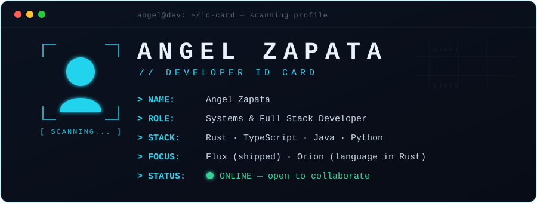
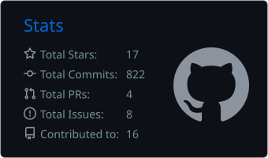
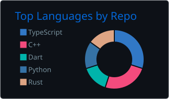
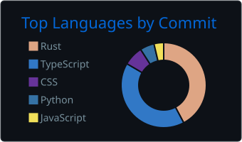

<div align="center">

<!-- ============ BANNER ============ -->


<!-- ============ TYPING EFFECT ============ -->
<a href="https://github.com/angeldevmobile">
  
</a>

<br/><br/>

<!-- ============ SOCIAL BADGES ============ -->
[](https://linkedin.com/in/gabriel-zapata-239501287/)
[](https://portfolio-angel-dev.onrender.com/)
[](mailto:zapata.axuariogabriel@gmail.com)


</div>

<br/>

## About me

```typescript
const angel = {
  role: "Systems & Full Stack Developer",
  location: "Perú",
  languages: ["Rust", "TypeScript", "Java", "Python", "Dart"],
  stack: {
    systems:  ["Rust", "Cranelift", "Tokio"],
    backend:  ["Node.js", "Spring Boot", "Flask"],
    frontend: ["React", "Next.js", "Flutter"],
    data:     ["PostgreSQL", "Prisma"],
  },
  shipped:  "Flux · API client, launched on Product Hunt & Hacker News",
  building: "Orion · a language written in Rust (VM, JIT, GC, 58+ stdlib modules)",
  background: "Banking & Fintech: secure payments, compliance, high-perf APIs",
  philosophy: "Build things that matter, ship things that work",
};
```

<br/>

## Projects

<table>
<tr>
<td width="50%" valign="top">

### 🛰️ Flux &nbsp;

Desktop API client & Postman alternative. AI test generation, gRPC, GraphQL, WebSocket, SSE, and a free CLI runner for CI.


[](https://fluxapi.dev)
[](https://github.com/angeldevmobile/Flux-Post)

</td>
<td width="50%" valign="top">

### ⚙️ Orion &nbsp;

A programming language written in Rust, in active development since early 2025. Bytecode VM, Cranelift JIT, custom GC, DAP debugger, 58+ stdlib modules, and 400+ automated tests.


[](https://github.com/angeldevmobile/Orion)
[](https://github.com/angeldevmobile/Extension-lenguaje-orion)

</td>
</tr>
<tr>
<td width="50%" valign="top">

### 🧠 Flux Learning &nbsp;

AI-powered flashcards with spaced repetition (SM-2), real-time duels, weekly leagues, and a deck marketplace. Import from PDF, YouTube or text.


[](https://flux-learning-7g6f.vercel.app/)

</td>
<td width="50%" valign="top">

### 🤖 Orion AI Platform &nbsp;

Multi-LLM automation platform, built as an application layer on top of Orion. Early stage, no public release yet.


</td>
</tr>
</table>

**Orion ecosystem:** [VS Code extension](https://github.com/angeldevmobile/Extension-lenguaje-orion) (IntelliSense, real compiler diagnostics, debugger) · [Playground API](https://github.com/angeldevmobile/PlayGround---API) (sandboxed execution, Rust + Axum)

<details>
<summary><b>A taste of Orion</b></summary>

```orion
use json
use fs

data = json.parse(fs.read("users.json"))
summary = json.extract(data, ["name", "age"])
show("Summary:", summary)
```

Clean syntax, gradual typing (type-checked by default), a concurrent HTTP server, and a columnar data engine (`.odf` format, ~8× faster than Python in benchmarks).
</details>

<br/>

## Tech Stack

<div align="center">

**Languages**


**Backend & APIs**


**Frontend & Mobile**


**Databases & Cloud**


**AI & Integrations**


</div>

<br/>

## GitHub Stats

<div align="center">








</div>

<!-- ============ SNAKE ANIMATION ============ -->
<div align="center">

<picture>
  <source media="(prefers-color-scheme: dark)" srcset="https://raw.githubusercontent.com/angeldevmobile/angeldevmobile/output/github-contribution-grid-snake-dark.svg">
  <source media="(prefers-color-scheme: light)" srcset="https://raw.githubusercontent.com/angeldevmobile/angeldevmobile/output/github-contribution-grid-snake.svg">
  
</picture>

</div>

<br/>

## Certifications & Learning

<table>
<tr>
<td width="50%" valign="top">

**Certifications**

| Certification | Issuer | Year |
|:---|:---|:---|
| OCI 2023 Certified Foundations Associate | Oracle | 2023 |
| OCI 2023 AI Certified Foundations Associate | Oracle | 2023 |
| Python for Data Science and AI | Coursera | 2024 |
| IBM Mainframe Developer | IBM |  |
| Google Data Analytics | Google |  |

</td>
<td width="50%" valign="top">

**Currently learning**

| Topic | Focus |
|:---|:---|
| Compiler design | LLVM, ANTLR4, AST optimization |
| Rust | Systems programming |
| Advanced ML | RAG systems, LLM fine-tuning |
| Distributed systems | Architecture patterns |

</td>
</tr>
</table>

<br/>

## Let's connect

<div align="center">

Open to collaborating on ambitious projects, discussing architecture decisions, or just talking tech.

[](https://linkedin.com/in/gabriel-zapata-239501287/)
[](mailto:zapata.axuariogabriel@gmail.com)
[](https://portfolio-angel-dev.onrender.com/)

<br/>

<sub><i>"Build things that matter, ship things that work."</i></sub>

</div>
